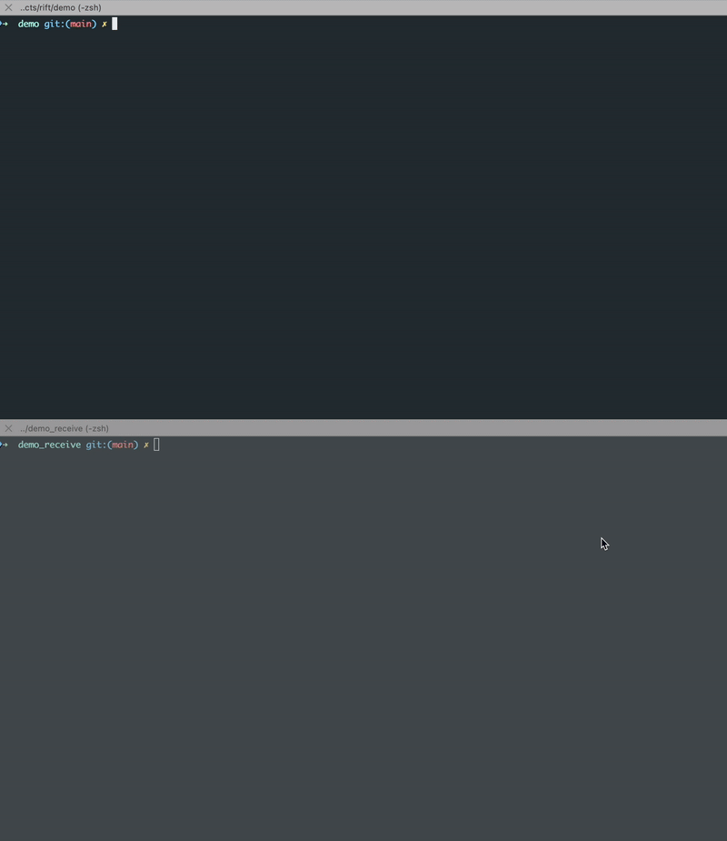

code # rift - Distributed File Transfer


A secure, peer-to-peer file transfer tool with relay fallback support.




## Prerequisites

Before building and using rift, ensure you have the following installed:

### Rust and Cargo

rift requires Rust 1.89.0 or later.

**Check if you have Rust installed:**
```bash
rustc --version
cargo --version
```

**Install Rust:**

If you don't have Rust installed, you can install it using [rustup](https://rustup.rs/):

```bash
# On macOS, Linux, or Unix-like OS
curl --proto '=https' --tlsv1.2 -sSf https://sh.rustup.rs | sh
```

## Installation

### Quick Install (Recommended)

Run the installation script to build and optionally install globally:

```bash
./install.sh
```

The script will:
1. Build the project in release mode
2. Offer to install the binary to `/usr/local/bin` for global access

### Building from Source

```bash
cargo build --release
```

The binary will be available at `./target/release/rift`.

### Install Globally (Manual)

```bash
# Copy to a directory in your PATH
sudo cp target/release/rift /usr/local/bin/

# Or use cargo install (if in a git repo)
cargo install --path .
```

## Usage

The CLI provides three main commands: `send`, `receive`, and `relay`.

### Send a File or Folder

```bash
# Send a file
rift send path/to/file.txt

# Send a folder (automatically compressed)
rift send path/to/folder

# Send with verbose logging
rift send path/to/file.txt --verbose
```

When you run the send command:
1. A 6-digit shared key is generated and copied to your clipboard
2. The tool connects to the relay server
3. File/folder is encrypted and transferred
4. Share the key with the receiver

### Receive a File or Folder

```bash

# Receive with key (key required)
rift receive 123456

# Receive with verbose logging
rift receive 123456 --verbose
```

When you run the receive command:
1. Enter the 6-digit shared key (or provide it as argument)
2. The tool connects to the relay server
3. File/folder is received and decrypted
4. Output is saved with `new_` prefix

### Run as Relay Server

```bash
# Run relay on default port (8080)
rift relay

# Run relay on custom port
rift relay --port 9000

# Run relay with verbose logging
rift relay --verbose
```

## Command Reference

### Global Options

- `-v, --verbose` - Enable verbose logging (shows debug information)
- `-h, --help` - Print help information
- `-V, --version` - Print version information

### `rift send`

**Usage:** `rift send [OPTIONS] <FILE_PATH>`

**Arguments:**
- `<FILE_PATH>` - Path to the file or folder to send

**Options:**
- `-v, --verbose` - Enable verbose logging

**Example:**
```bash
# Send a file normally
rift send document.pdf

# Send with detailed logs
rift send document.pdf --verbose

# Send a folder (will be compressed automatically)
rift send ./my-project
```

### `rift receive`

**Usage:** `rift receive [OPTIONS] [KEY]`

**Arguments:**
- `[KEY]` - Optional 6-digit shared key (will prompt if not provided)

**Options:**
- `-v, --verbose` - Enable verbose logging

**Example:**
```bash
# Receive with prompt
rift receive

# Receive with key directly
rift receive 123456

# Receive with verbose output
rift receive 123456 --verbose
```

### `rift relay`

**Usage:** `rift relay [OPTIONS]`

**Options:**
- `-p, --port <PORT>` - Port to bind to (default: 8080)
- `-v, --verbose` - Enable verbose logging

**Example:**
```bash
# Run on default port
rift relay

# Run on custom port
rift relay --port 9000

# Run with verbose logging
rift relay --verbose
```

## Verbose Logging

When you use the `--verbose` flag (or `-v`), you'll see detailed information about:

- Connection establishment (relay and P2P attempts)
- PAKE handshake details
- Chunk processing (encryption/decryption)
- File compression/decompression
- Network operations
- Error details

**Example verbose output:**
```bash
$ rift send test.txt --verbose
[2024-10-19T10:30:45Z INFO  rift] Verbose logging enabled
[2024-10-19T10:30:45Z DEBUG rift::commands::send] Starting send command for path: test.txt
[2024-10-19T10:30:45Z DEBUG rift::commands::send] Generated shared key: 123456, room: 1234
shared key (copied to clipboard): 123456
[2024-10-19T10:30:45Z INFO  rift::commands::send] Connecting to relay server at 45.55.102.56:8080
[2024-10-19T10:30:45Z DEBUG rift::networking] Establishing connection to relay server at 45.55.102.56:8080
Connected to relay server at 45.55.102.56:8080
[2024-10-19T10:30:45Z DEBUG rift::commands::send] Performing PAKE handshake
...
```

## Benchmarks
```
=========================================
Rift Benchmark Results
=========================================

Test Name                      |            Size |           Time |      Throughput | Status
------------------------------------------------------------------------------------------------------------------------
folder_100x1kb                 |            400K |        0.862s |         0.11 MB/s | ✓ SUCCESS
folder_50x1mb                  |             50M |        1.830s |        27.32 MB/s | ✓ SUCCESS
folder_10x10mb                 |            100M |        2.905s |        34.41 MB/s | ✓ SUCCESS
folder_mixed                   |            6.0M |        0.860s |         6.99 MB/s | ✓ SUCCESS
10kb                           |             12K |        0.833s |         0.01 MB/s | ✓ SUCCESS
100kb                          |            100K |        0.724s |         0.13 MB/s | ✓ SUCCESS
1mb_text                       |            1.0M |        0.733s |         1.36 MB/s | ✓ SUCCESS
1mb_binary                     |            1.0M |        0.737s |         1.35 MB/s | ✓ SUCCESS
10mb_text                      |             10M |        0.789s |        12.68 MB/s | ✓ SUCCESS
10mb_binary                    |             10M |        0.790s |        12.66 MB/s | ✓ SUCCESS
100mb_text                     |            100M |        1.336s |        74.85 MB/s | ✓ SUCCESS
100mb_binary                   |            100M |        1.345s |        74.37 MB/s | ✓ SUCCESS
500mb                          |            500M |        3.681s |       135.84 MB/s | ✓ SUCCESS
1gb_text                       |            1.0G |        6.718s |       152.43 MB/s | ✓ SUCCESS
1gb_binary                     |            1.0G |        6.545s |       156.44 MB/s | ✓ SUCCESS
5gb                            |            5.0G |       30.831s |       166.06 MB/s | ✓ SUCCESS
10gb                           |            7.7G |       46.751s |       169.38 MB/s | ✓ SUCCESS
```

## Features

- **Secure Transfer**: Uses PAKE (Password Authenticated Key Exchange) and ChaCha20-Poly1305 encryption
- **P2P Connection**: Attempts direct peer-to-peer connection with automatic relay fallback
- **Folder Support**: Automatically compresses folders before transfer
- **Progress Bars**: Visual feedback during transfer
- **Clipboard Integration**: Shared key automatically copied to clipboard
- **Flexible CLI**: Multiple ways to use each command

## Technical Details

- **Encryption**: ChaCha20-Poly1305 AEAD cipher
- **Key Exchange**: SPAKE2 PAKE protocol
- **Chunk Size**: 1KB chunks for efficient streaming
- **Default Relay**: 45.55.102.56:8080

## Quick Start Example

### Terminal 1 (Sender):
```bash
$ rift send document.pdf
shared key (copied to clipboard): 456789
Connected to relay server at 45.55.102.56:8080
P2P connection established, closing relay
Transfer Complete!
```

### Terminal 2 (Receiver):
```bash
$ rift receive 456789
Connected to relay server at 45.55.102.56:8080
P2P connection established, closing relay
Download complete!
File saved: new_document.pdf
```

## Development

### Running in Development

```bash
# Send
cargo run -- send test.txt

# Receive
cargo run -- receive 123456

# Relay
cargo run -- relay --verbose
```

## Troubleshooting

### P2P Connection Failed

If P2P connection fails, the tool automatically falls back to relay connection. This is normal for networks with strict NAT/firewall rules.

### Connection Timeout

Ensure the relay server is accessible and running. Check your network connection.

### Verbose Mode for Debugging

Always use `--verbose` flag when troubleshooting issues to see detailed logs.
